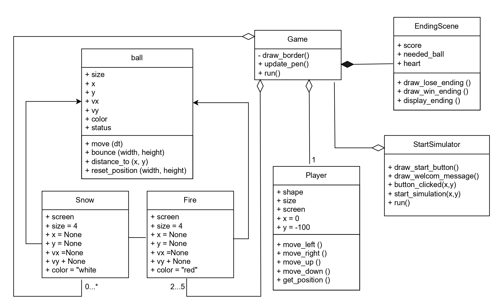

This project is called "Help the snowman,please!"

It is a game where the player help snowman collecting the snow  to fix himself after melting during the summer. 
I've got the inspiration from Christmas since this month is December, so I decided to do something related to it.
At first, I want to make a ping pong game but then, I think if I do a normal ping pong game
my rate would be 80. So I start anew with the new concept. I would rate this 90 but if All professors rate me 100 
I would be totally happy. 

How to run the project: After downloading all file needed, run the code in main.py file

How to play: You will start with 3 hearts. and 0 scores. You need to collect the snow according to
the snowman wishes, but at the same time you need to avoid the obstacles which are fireballs that will melt the snow.

I use original Ball class to create snowballs and fireballs and modify the Paddle class to a player class.
For the Ball class, it calculates movement of the ball. The Snow and Fire class then inherited from Ball class
and work as an object. The Player class controls the player movement and include the method of 
moving up, down, left, and right. The ending class has methods that draw the win ending and lose ending.
And show if a player win or lose by display_ending method. Next, the Game class, it is like a final class where
everything is combined and run as a game. I used the provided code to draw the border. The program will listen to
keypress and move the player based on the movement method defined in the Player class.
This class calculated if the Ball hit the player or not then score them.
Finally, we have the StartSimulator class which draw an opening message and if you click the start button, it will
call the Game.run().

I haven't found the bug in this game yet. So right now, I'm satisfied with the result. Even though, during the process
I've met a lot of obstacle and feel like to give up. But now I'm done and very happy.

link to video demo https://youtu.be/1ISeKdA2mBc?si=bGx8a92F3gzhoAoH